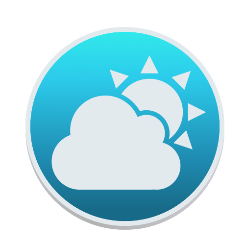

## Weatherette

Weatherette (pronounced *i dont know how to pronounce it*) is a small
macOS menu bar application that shows current current weather conditions
and provides simple, 9-hour forecast.



> If you seen [Beengpaper](https://github.com/rughalt/beengpaper) this
> icon should look familiar

### Requirements
Weatherette requires macOS El Captain (10.11) or later.

### Installation 

Download the application here, open `.dmg` file and drag and drop the
app into Applications folder.

### Building the app yourself

Weatherette is written in Python (Python 3.7), using rumps and appscript
libraries. Additionally you need py2app to build the application package
and create-dmg (awesome little tool for creating dmg files you can find
[here](https://github.com/sindresorhus/create-dmg)).

```
git clone
cd weatherette
python setup.py py2app
```

### FAQ
**Q. But why?**

A. Like with [Beengpaper](https://github.com/rughalt/beengpaper) I got
boread and decided that shelling out cash for for menu-bar application
(that most of the websites featured) is kinda stupid. Of course I didnt
know about
[Weather Bar](https://github.com/manifestinteractive/weather-bar-app)
back then, but well - mine app is simpler.


### License and copyright

Copyright © 2019 Antoni Sobkowicz / Dragonshorn Studios.

This program is licensed under MIT license.

All product names, logos, and brands are property of their respective
owners. All company, product and service names used in this website are
for identification purposes only. Use of these names, logos, and brands
does not imply endorsement.
